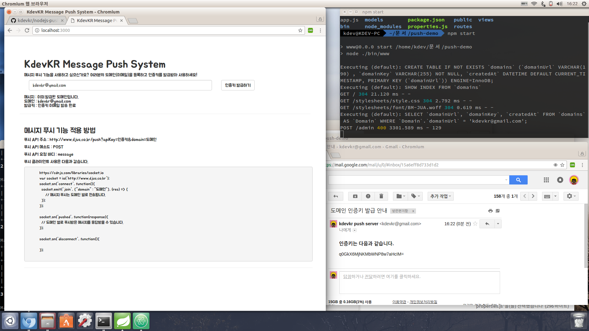

#노드JS로 알아보는 웹 메시지 푸시 서비스 만들기[개인정보 삭제]  



## 1. NodeJS를 간단히 알아봅시다.  
노드JS는 자바스크립트로 이루어진 서버-사이드 언어입니다. 원래 자바스크립트는 웹 브라우저가 이해할 수 있는 언어이기 때문에 프론트단에서 주로 사용되었습니다. 그러나 구글이 개발한 자바스크립트 V8 엔진으로 인하여 발전하게 되었습니다. 노드JS의 장점은 Event-Driven, Non-Blocking I/O, Async Callback이 아닙니다. 단순히 자바스크립트로 서버 애플리케이션을 만들 수 있다는 것인데요 애초에 Event-Driven과 같은 기법들은 다른 언어에도 존재하는 방식이었고 관심이었습니다. 노드JS가 Event-Driven, Non-Blocking I/O, Async Callback라는 방식을 고려한 이유는 자바스크립트에는 멀티스레드에 대한 부분을 지원하지 않기 때문입니다. 서버의 목적은 수천 수만개의 요청을 처리하는 것이기 때문에 멀티태스킹이 되어야만 한다는 것을 고려해보면 이해할 수 있습니다.  

*이로인해 서버 애플리케이션을 구축할 수 있는 기술을 다양해졌다고 보면 됩니다. NodeJS, Ruby on Rails, Django, Spring, Vert.x, Lalavel, Play등과 같은!*  

### 1.1 노드JS 설치하기  
데비안 계열(Ubuntu)에서 NodeJS를 설치할 경우에는 다음과 같이 curl을 사용해서 설치파일을 가져올 수 있습니다. [nodejs.org](https://nodejs.org)에서 제공하는 쉘 명령어이에요.

```sh
sudo apt-get install curl
curl -sL https://deb.nodesource.com/setup_6.x | sudo -E bash -
sudo apt-get install -y nodejs
```

제대로 설치되었는지를 확인하기 위해서는 `터미널`이나 명령 프롬프트에서 `node --version`을 확인하면 됩니다 다양한 모듈은 [npmjs](https://www.npmjs.org)에서 검색하면 됩니다.

### 1.2 NPM으로 의존성 모듈 관리하기
`NPM`이란 `Node Package Modules`이라고 하는데, NodeJS에서 활용하는 일련의 패키지 모듈들을 관리하는 것인데, 최근에는 이 NPM을 NodeJS와 같이 설치되므로 개별적으로 설치할 필요가 없습니다.

단순히, `NPM`은 해당 디렉토리안에서 `package.json` 파일을 통해서 모듈을 관리해준다고 이해하시면 됩니다. 만약에, package.json안에 express과 socket.io가 `의존성 라이브러리 목록`에 추가되어있다면 다음과 같이 npm으로 설치할 수 있습니다.

```sh
npm install express
npm install socket.io
```
물론, 설치하면서 package.json 파일에 자동적으로 추가하는 방법도 존재합니다.

```sh
npm install --save express
npm install --save socket.io
```

## 2. 메시지 푸시 서비스 동작 원리
일단 저는 대표적으로 다음과 같은 모듈들을 사용해서 `메시지 푸시 서비스`를 만들었습니다.

- express.js, 웹 MVC  
- socket.io, 소켓 통신  
- crypto, 암호화
- nodemailer, 이메일  
- cors, 크로스 도메인 정책
- sequelize, ORM    

### 2.1 서버 애플리케이션을 통한 도메인 정보 발급 기능  
메시지 푸시에 대해서 등록된 도메인(이메일)을 검증하도록 하기 위해서 서버 애플리케이션의 데이터베이스의 발급된 도메인 정보를 저장하도록 하였습니다. 단순히 쿼리문을 통해서 접근하기 보다는 노드JS의 모듈 중 Sequalize라는 ORM 모듈을 통해서 테이블 엔터티 객체를 이용하도록 하였습니다.  

```js  
www/models/config.js //데이터베이스 ORM 설정 스크립트
www/models/domain.js //도메인 엔터티 스크립트
www/routes/AdminController.js //도메인 발급 컨트롤러
```

### 2.2 서버 애플리케이션을 통한 메시지 푸시 기능  
메시지 푸시는 무조건 서버 애플리케이션을 통해서 검증되면 각 도메인별 소켓들에게 전송되어지도록 구현하였습니다. 다른 도메인에서 해당 서비스를 사용하기 위해서는 크로스 도메인 요청을 해야 하기 때문에 서버 측에서 CORS 모듈을 통해 허용할 수 있도록 하였습니다.

```js  
www/bin/www //socket.io 설정 스크립트
www/routes/PushController.js //메시지 푸시 컨트롤러
```

### 2.3 클라이언트 애플리케이션의 메시지 푸시 서비스 이용방법  
[socket.io.cdn](https://cdnjs.com/libraries/socket.io)을 통해서 클라이언트에서 사용할 자바스크립트 파일을 HTML 문서에 포함시켜야 합니다.

```js
<script>
var socket = io('서버 주소');
socket.on('connect', function(){
  //연결되었다면 반드시 도메인에 참가해야 합니다.
  //이때 푸시되는 메시지는 해당 도메인에 푸시되는 메시지들만 받아올 수 있습니다.
  socket.emit('join', {"domain" : "kdevkr@gmail.com"}, (res) => {

  });
  socket.on('pushed', function(res){
    //참가한 도메인에서 푸시된 메시지를 이제 활용하면 됩니다.
  })
  socket.on('disconnect', function(){});
});

//메시지를 푸시하기 위해서는 다음과 같이 요청해야 합니다.
function push_example(){
  var dataSet = {
    message : "메시지"
  };

  $.ajax({
    url: "서버주소/push?apiKey=인증키&domain=발급된도메인",
    type: "post",
    data: dataset,
    success : function(response){
      //정상적으로 메시지가 푸시될 경우
    },
    error : function(response){
      //인증키 또는 도메인에 대한 파라미터값이 제공되지 않을 경우
      //발급된 도메인이 아닌 경우
      //발급된 도메인이나 인증키가 올바르지 않은 경우
    }
  });
}
</script>
```

이러면 이제 여러분만의 메시지 푸시 서비스를 만들 수 있습니다!

## 3. 실행 방법  
서버 애플리케이션을 실행하기 위해서는 간단한 설정이 필요합니다.

### 3.1 데이터베이스 설정하기  
MySQL, PostgreSQL, MariaDB등 sequelize 모듈에서 지원하는 데이터베이스를 설정해야 합니다.

```js
var sequelize = new Sequelize('sample', 'test', 'test',{ // 데이터베이스 이름, 계정, 비밀번호
  host : 'localhost', // 데이터베이스 주소
  dialect : 'mariadb', // 설치한 데이터베이스 유형
  // 커넥션 풀 설정
  pool : {
    max: 5,
    min: 0,
    idel: 10000
  }
});
```

### 3.2 암호화 키 설정하기  
보안성을 위해서 암호화 키를 변경하는게 좋습니다. 자신만의 키를 만들어 설정합시다.

```js
www/properties.js
var properties = {
  'key':'임의의 키' // 도메인 인증키 발급시 사용됩니다.
};
```

### 3.3 발급 메일 설정하기  
인증키를 발급하기 위해서는 이메일을 통해서 전달하는게 가장 좋겠죠? `지메일을 설정`합시다. 물론 SMTP는 개별적으로 하셔야합니다.

```js
var smtp = nodemailer.createTransport({
  service : 'gmail',
  auth : {
    user : 'kdevkr@gmail.com', // SMTP 기능이 활성화된 지메일
    pass : '비밀번호 비공개' // 지메일의 비밀번호
  }
});
```

www 폴더로 이동 - `npm start` or `npm run autorun`
